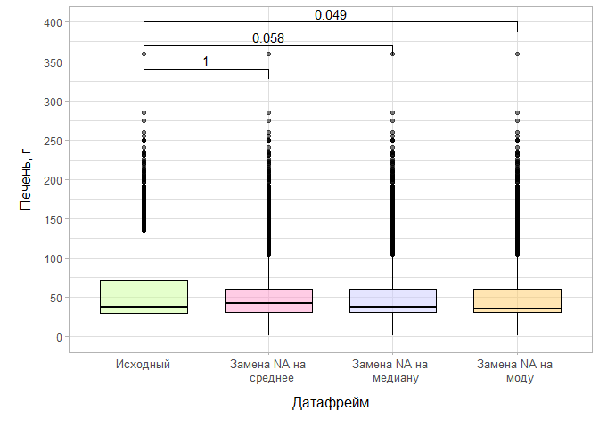
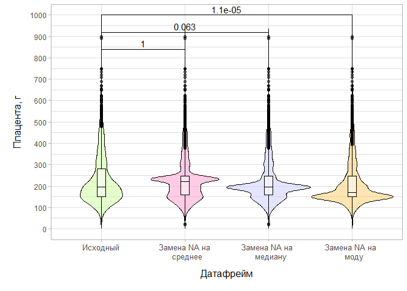
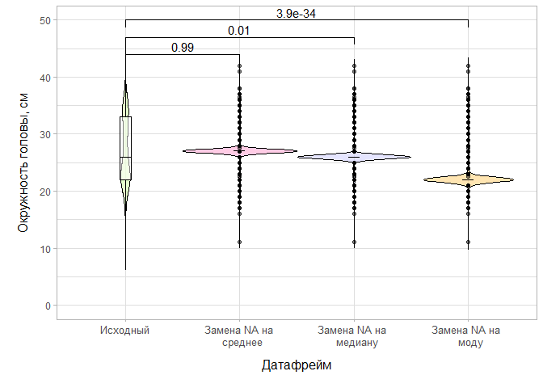

DF1_processing_mean_median_moda
================
Evgeniia Molokova
2022-12-13

# Настройка библиотек

 

 

# 1. Загрузка отфильтрованного датафрейма df1

``` r
df1 <- read_csv("df1_csv.csv")
```

    ## Rows: 2814 Columns: 25
    ## ── Column specification ────────────────────────────────────────────────────────
    ## Delimiter: ","
    ## chr  (6): Пол, мёртвый/живой, возраст, Мацерация, ВПР, Многоплодная
    ## dbl (18): № протокола, Гестация, Длина тела, Масса тела, Мозг, Сердце, Лёгки...
    ## lgl  (1): СЗРП
    ## 
    ## ℹ Use `spec()` to retrieve the full column specification for this data.
    ## ℹ Specify the column types or set `show_col_types = FALSE` to quiet this message.

``` r
df1 <- as.tibble(df1)
```

    ## Warning: `as.tibble()` was deprecated in tibble 2.0.0.
    ## ℹ Please use `as_tibble()` instead.
    ## ℹ The signature and semantics have changed, see `?as_tibble`.

``` r
summary(df1)
```

    ##   № протокола         Пол            мёртвый/живой        возраст         
    ##  Min.   :   1.0   Length:2814        Length:2814        Length:2814       
    ##  1st Qu.: 278.0   Class :character   Class :character   Class :character  
    ##  Median : 540.5   Mode  :character   Mode  :character   Mode  :character  
    ##  Mean   : 544.3                                                           
    ##  3rd Qu.: 812.8                                                           
    ##  Max.   :1290.0                                                           
    ##                                                                           
    ##     Гестация       Длина тела     Масса тела        Мозг       
    ##  Min.   :15.00   Min.   :15.0   Min.   :  71   Min.   :   5.0  
    ##  1st Qu.:23.00   1st Qu.:29.0   1st Qu.: 600   1st Qu.:  90.0  
    ##  Median :25.00   Median :32.0   Median : 775   Median : 115.1  
    ##  Mean   :27.53   Mean   :35.4   Mean   :1265   Mean   : 171.8  
    ##  3rd Qu.:31.00   3rd Qu.:41.0   3rd Qu.:1510   3rd Qu.: 231.2  
    ##  Max.   :43.00   Max.   :61.0   Max.   :6245   Max.   :1720.0  
    ##                  NA's   :27     NA's   :9      NA's   :398     
    ##      Сердце            Лёгкие           Печень         Селезёнка      
    ##  Min.   :  0.900   Min.   :  1.60   Min.   :  1.00   Min.   :  0.100  
    ##  1st Qu.:  4.300   1st Qu.: 16.30   1st Qu.: 29.10   1st Qu.:  1.100  
    ##  Median :  5.600   Median : 21.00   Median : 37.30   Median :  1.800  
    ##  Mean   :  8.979   Mean   : 30.03   Mean   : 59.98   Mean   :  4.353  
    ##  3rd Qu.: 11.300   3rd Qu.: 36.50   3rd Qu.: 71.40   3rd Qu.:  5.000  
    ##  Max.   :440.000   Max.   :432.00   Max.   :360.00   Max.   :510.000  
    ##  NA's   :353       NA's   :345      NA's   :357      NA's   :369      
    ##      Почки            Тимус         Надпочечники    Поджелудочная железа
    ##  Min.   :  0.50   Min.   : 0.100   Min.   : 0.100   Min.   : 0.000      
    ##  1st Qu.:  6.30   1st Qu.: 1.500   1st Qu.: 2.000   1st Qu.: 0.800      
    ##  Median :  8.30   Median : 2.300   Median : 2.500   Median : 1.100      
    ##  Mean   : 12.30   Mean   : 4.439   Mean   : 3.917   Mean   : 1.851      
    ##  3rd Qu.: 16.15   3rd Qu.: 5.400   3rd Qu.: 4.600   3rd Qu.: 2.400      
    ##  Max.   :195.00   Max.   :45.000   Max.   :38.100   Max.   :20.800      
    ##  NA's   :355      NA's   :401      NA's   :495      NA's   :1357        
    ##     Плацента       Мацерация             ВПР            Многоплодная      
    ##  Min.   :  20.0   Length:2814        Length:2814        Length:2814       
    ##  1st Qu.: 150.0   Class :character   Class :character   Class :character  
    ##  Median : 195.0   Mode  :character   Mode  :character   Mode  :character  
    ##  Mean   : 233.1                                                           
    ##  3rd Qu.: 280.0                                                           
    ##  Max.   :2100.0                                                           
    ##  NA's   :582                                                              
    ##    СЗРП         Окружность головы Окружность груди      Год      
    ##  Mode:logical   Min.   :11.00     Min.   :12.00    Min.   :2005  
    ##  NA's:2814      1st Qu.:22.00     1st Qu.:19.00    1st Qu.:2007  
    ##                 Median :26.00     Median :23.00    Median :2009  
    ##                 Mean   :27.02     Mean   :24.76    Mean   :2009  
    ##                 3rd Qu.:33.00     3rd Qu.:31.00    3rd Qu.:2012  
    ##                 Max.   :42.00     Max.   :41.00    Max.   :2014  
    ##                 NA's   :2485      NA's   :2491                   
    ##  Возраст в днях  
    ##  Min.   :0.0000  
    ##  1st Qu.:0.0000  
    ##  Median :0.0000  
    ##  Mean   :0.2292  
    ##  3rd Qu.:0.0000  
    ##  Max.   :1.0000  
    ## 

 

 

# 2.1 Замена пропущенных значений в количественных переменных на средние значения и создание нового датасета df1_process_mean

``` r
df1_process_mean <- df1 # Создание нового датасета 

df1_process_mean$`Длина тела`[is.na(df1_process_mean$`Длина тела`)]<-mean(df1_process_mean$`Длина тела`,na.rm=TRUE) # Замена пропущенных значений в переменной "Длина тела"

df1_process_mean$`Масса тела`[is.na(df1_process_mean$`Масса тела`)]<-mean(df1_process_mean$`Масса тела`,na.rm=TRUE) # Замена пропущенных значений в переменной "Масса тела"

df1_process_mean$Мозг[is.na(df1_process_mean$Мозг)]<-mean(df1_process_mean$Мозг,na.rm=TRUE) # Замена пропущенных значений в переменной "Мозг"

df1_process_mean$Сердце[is.na(df1_process_mean$Сердце)]<-mean(df1_process_mean$Сердце,na.rm=TRUE) # Замена пропущенных значений в переменной "Сердце"

df1_process_mean$Лёгкие[is.na(df1_process_mean$Лёгкие)]<-mean(df1_process_mean$Лёгкие,na.rm=TRUE) # Замена пропущенных значений в переменной "Лёгкие"

df1_process_mean$Печень[is.na(df1_process_mean$Печень)]<-mean(df1_process_mean$Печень,na.rm=TRUE) # Замена пропущенных значений в переменной "Печень"

df1_process_mean$Селезёнка[is.na(df1_process_mean$Селезёнка)]<-mean(df1_process_mean$Селезёнка, na.rm=TRUE) # Замена пропущенных значений в переменной "Селезёнка"

df1_process_mean$Почки[is.na(df1_process_mean$Почки)]<-mean(df1_process_mean$Почки,na.rm=TRUE) # Замена пропущенных значений в переменной "Почки"

df1_process_mean$Тимус[is.na(df1_process_mean$Тимус)]<-mean(df1_process_mean$Тимус,na.rm=TRUE) # Замена пропущенных значений в переменной "Тимус"

df1_process_mean$Надпочечники[is.na(df1_process_mean$Надпочечники)]<-mean(df1_process_mean$Надпочечники,na.rm=TRUE) # Замена пропущенных значений в переменной "Надпочечники"

df1_process_mean$`Поджелудочная железа`[is.na(df1_process_mean$`Поджелудочная железа`)]<-mean(df1_process_mean$`Поджелудочная железа`,na.rm=TRUE) # Замена пропущенных значений в переменной "Поджелудочная железа"

df1_process_mean$Плацента[is.na(df1_process_mean$Плацента)]<-mean(df1_process_mean$Плацента,na.rm=TRUE) # Замена пропущенных значений в переменной "Плацента"

df1_process_mean$`Окружность головы`[is.na(df1_process_mean$`Окружность головы`)]<-mean(df1_process_mean$`Окружность головы`,na.rm=TRUE) # Замена пропущенных значений в переменной "Окружность головы"

df1_process_mean$`Окружность груди`[is.na(df1_process_mean$`Окружность груди`)]<-mean(df1_process_mean$`Окружность груди`,na.rm=TRUE) # Замена пропущенных значений в переменной "Окружность груди"

df1_process_mean <- df1_process_mean %>%
  mutate(across(c(`Длина тела`,`Масса тела`,`Мозг`,`Сердце`,`Лёгкие`,`Печень`, `Селезёнка`,`Почки`,`Тимус`,`Надпочечники`,`Поджелудочная железа`,`Плацента`,`Окружность головы`,`Окружность груди`), function(x) round(x,2)))

summary(df1_process_mean)
```

    ##   № протокола         Пол            мёртвый/живой        возраст         
    ##  Min.   :   1.0   Length:2814        Length:2814        Length:2814       
    ##  1st Qu.: 278.0   Class :character   Class :character   Class :character  
    ##  Median : 540.5   Mode  :character   Mode  :character   Mode  :character  
    ##  Mean   : 544.3                                                           
    ##  3rd Qu.: 812.8                                                           
    ##  Max.   :1290.0                                                           
    ##     Гестация       Длина тела     Масса тела        Мозг        
    ##  Min.   :15.00   Min.   :15.0   Min.   :  71   Min.   :   5.00  
    ##  1st Qu.:23.00   1st Qu.:29.0   1st Qu.: 600   1st Qu.:  92.38  
    ##  Median :25.00   Median :32.0   Median : 779   Median : 130.00  
    ##  Mean   :27.53   Mean   :35.4   Mean   :1265   Mean   : 171.79  
    ##  3rd Qu.:31.00   3rd Qu.:41.0   3rd Qu.:1500   3rd Qu.: 185.00  
    ##  Max.   :43.00   Max.   :61.0   Max.   :6245   Max.   :1720.00  
    ##      Сердце            Лёгкие           Печень         Селезёнка      
    ##  Min.   :  0.900   Min.   :  1.60   Min.   :  1.00   Min.   :  0.100  
    ##  1st Qu.:  4.400   1st Qu.: 16.93   1st Qu.: 30.60   1st Qu.:  1.200  
    ##  Median :  6.165   Median : 22.79   Median : 41.70   Median :  2.100  
    ##  Mean   :  8.979   Mean   : 30.03   Mean   : 59.98   Mean   :  4.353  
    ##  3rd Qu.:  9.197   3rd Qu.: 32.10   3rd Qu.: 60.00   3rd Qu.:  4.350  
    ##  Max.   :440.000   Max.   :432.00   Max.   :360.00   Max.   :510.000  
    ##      Почки           Тимус         Надпочечники    Поджелудочная железа
    ##  Min.   :  0.5   Min.   : 0.100   Min.   : 0.100   Min.   : 0.00       
    ##  1st Qu.:  6.5   1st Qu.: 1.600   1st Qu.: 2.100   1st Qu.: 1.10       
    ##  Median :  9.2   Median : 2.700   Median : 3.000   Median : 1.85       
    ##  Mean   : 12.3   Mean   : 4.439   Mean   : 3.917   Mean   : 1.85       
    ##  3rd Qu.: 13.3   3rd Qu.: 4.440   3rd Qu.: 3.920   3rd Qu.: 1.85       
    ##  Max.   :195.0   Max.   :45.000   Max.   :38.100   Max.   :20.80       
    ##     Плацента       Мацерация             ВПР            Многоплодная      
    ##  Min.   :  20.0   Length:2814        Length:2814        Length:2814       
    ##  1st Qu.: 160.0   Class :character   Class :character   Class :character  
    ##  Median : 220.0   Mode  :character   Mode  :character   Mode  :character  
    ##  Mean   : 233.1                                                           
    ##  3rd Qu.: 248.0                                                           
    ##  Max.   :2100.0                                                           
    ##    СЗРП         Окружность головы Окружность груди      Год      
    ##  Mode:logical   Min.   :11.00     Min.   :12.00    Min.   :2005  
    ##  NA's:2814      1st Qu.:27.02     1st Qu.:24.76    1st Qu.:2007  
    ##                 Median :27.02     Median :24.76    Median :2009  
    ##                 Mean   :27.02     Mean   :24.76    Mean   :2009  
    ##                 3rd Qu.:27.02     3rd Qu.:24.76    3rd Qu.:2012  
    ##                 Max.   :42.00     Max.   :41.00    Max.   :2014  
    ##  Возраст в днях  
    ##  Min.   :0.0000  
    ##  1st Qu.:0.0000  
    ##  Median :0.0000  
    ##  Mean   :0.2292  
    ##  3rd Qu.:0.0000  
    ##  Max.   :1.0000

 

 

# 2.2 Описательная статистика нового датафрейма df1_process_mean

``` r
library (maditr)
```

    ## Warning: пакет 'maditr' был собран под R версии 4.2.2

    ## 
    ## To aggregate all non-grouping columns: take_all(mtcars, mean, by = am)

    ## 
    ## Присоединяю пакет: 'maditr'

    ## Следующий объект скрыт от 'package:readr':
    ## 
    ##     cols

    ## Следующие объекты скрыты от 'package:dplyr':
    ## 
    ##     between, coalesce, first, last

``` r
library (flextable)
```

    ## Warning: пакет 'flextable' был собран под R версии 4.2.2

``` r
library (tidyr)

statistics <- list(
      `Количество субъектов` = ~length(.x),
      `Количество (есть данные)` = ~sum(!is.na(.x)),
      `Нет данных` = ~sum(is.na(.x)),
      `Ср. знач.` = ~ifelse(sum(!is.na(.x)) == 0, "Н/П*", mean(.x, na.rm = TRUE) %>% round(2) %>% as.character()),
      `Станд. отклон.` = ~ifelse(sum(!is.na(.x)) < 3, "Н/П*", sd(.x, na.rm = TRUE) %>% round(2) %>% as.character()),
      `мин. - макс.` = ~ifelse(sum(!is.na(.x)) == 0, "Н/П*", paste0(min(.x, na.rm = TRUE) %>% round(2), " - ", max(.x, na.rm = TRUE) %>% round(2))),
      `Медиана` = ~ifelse(sum(!is.na(.x)) == 0, "Н/П*", median(.x, na.rm = TRUE) %>% round(2) %>% as.character()),
      `Q1 - Q3` = ~ifelse(sum(!is.na(.x)) == 0, "Н/П*", paste0(quantile(.x, 0.25, na.rm = TRUE) %>% round(2), " - ", quantile(.x, 0.75, na.rm = TRUE) %>% round(2)))
)


df1_all_1 <- df1_process_mean %>%
  mutate(`мёртвый/живой` = "Всего")

df1_work_1 <- rbind(df1_process_mean, df1_all_1)

stat_num_res <- df1_work_1 %>%
  select(`мёртвый/живой`, where(is.numeric)) %>%
  group_by(`мёртвый/живой`) %>%
  summarise(across(where(is.numeric), statistics)) %>%
  mutate(across(everything(), as.character)) %>% 
  pivot_longer(!`мёртвый/живой`) %>%
  separate(name, into  = c("Переменная","Статистика"), sep = "_") %>% 
  dcast(`Переменная` + `Статистика` ~ `мёртвый/живой`, value.var = "value") 


stat_num_res %>% 
  flextable() %>%
  theme_box() %>%
  merge_v(c( "Переменная")) %>%
  set_caption("Описательная статистика количественных переменных") 
```

 

 

# 2.3 Сравнение нового датафрейма df1_process_mean с исходным датасетом df1

``` r
res.length <- t.test(df1$`Длина тела`, df1_process_mean$`Длина тела`, alternative="two.sided")
res.length$p.value
```

    ## [1] 0.9999095

``` r
res.length$conf.int
```

    ## [1] -0.4697774  0.4698318
    ## attr(,"conf.level")
    ## [1] 0.95

``` r
res.mass <- t.test(df1$`Масса тела`, df1_process_mean$`Масса тела`, alternative="two.sided")
res.mass$p.value
```

    ## [1] 0.9999998

``` r
res.mass$conf.int
```

    ## [1] -54.12317  54.12319
    ## attr(,"conf.level")
    ## [1] 0.95

``` r
res.brain <- t.test(df1$Мозг, df1_process_mean$Мозг, alternative="two.sided")
res.brain$p.value
```

    ## [1] 0.9999699

``` r
res.brain$conf.int
```

    ## [1] -6.517855  6.518105
    ## attr(,"conf.level")
    ## [1] 0.95

``` r
res.heart <- t.test(df1$Сердце, df1_process_mean$Сердце, alternative="two.sided")
res.heart$p.value
```

    ## [1] 0.9997807

``` r
res.heart$conf.int
```

    ## [1] -0.6290050  0.6288286
    ## attr(,"conf.level")
    ## [1] 0.95

``` r
res.lung <- t.test(df1$Лёгкие, df1_process_mean$Лёгкие, alternative="two.sided")
res.lung$p.value
```

    ## [1] 0.9996489

``` r
res.lung$conf.int
```

    ## [1] -1.232053  1.232606
    ## attr(,"conf.level")
    ## [1] 0.95

``` r
res.liver <- t.test(df1$Печень, df1_process_mean$Печень, alternative="two.sided")
res.liver$p.value
```

    ## [1] 0.9998294

``` r
res.liver$conf.int
```

    ## [1] -2.570138  2.570699
    ## attr(,"conf.level")
    ## [1] 0.95

``` r
res.splen <- t.test(df1$Селезёнка, df1_process_mean$Селезёнка, alternative="two.sided")
res.splen$p.value
```

    ## [1] 0.9990076

``` r
res.splen$conf.int
```

    ## [1] -0.6682005  0.6690489
    ## attr(,"conf.level")
    ## [1] 0.95

``` r
res.ren <- t.test(df1$Почки, df1_process_mean$Почки, alternative="two.sided")
res.ren$p.value
```

    ## [1] 0.9984122

``` r
res.ren$conf.int
```

    ## [1] -0.5195252  0.5205810
    ## attr(,"conf.level")
    ## [1] 0.95

``` r
res.thimus <- t.test(df1$Тимус, df1_process_mean$Тимус, alternative="two.sided")
res.thimus$p.value
```

    ## [1] 0.9988749

``` r
res.thimus$conf.int
```

    ## [1] -0.2563437  0.2559752
    ## attr(,"conf.level")
    ## [1] 0.95

``` r
res.supraren <- t.test(df1$Надпочечники, df1_process_mean$Надпочечники, alternative="two.sided")
res.supraren$p.value
```

    ## [1] 0.9946869

``` r
res.supraren$conf.int
```

    ## [1] -0.1711866  0.1700275
    ## attr(,"conf.level")
    ## [1] 0.95

``` r
res.pancreas <- t.test(df1$`Поджелудочная железа`, df1_process_mean$`Поджелудочная железа`, alternative="two.sided")
res.pancreas$p.value
```

    ## [1] 0.9952185

``` r
res.pancreas$conf.int
```

    ## [1] -0.09716534  0.09776109
    ## attr(,"conf.level")
    ## [1] 0.95

``` r
res.placenta <- t.test(df1$Плацента, df1_process_mean$Плацента, alternative="two.sided")
res.placenta$p.value
```

    ## [1] 0.9999402

``` r
res.placenta$conf.int
```

    ## [1] -7.155654  7.155107
    ## attr(,"conf.level")
    ## [1] 0.95

``` r
res.head <- t.test(df1$`Окружность головы`, df1_process_mean$`Окружность головы`, alternative="two.sided")
res.head$p.value
```

    ## [1] 0.9938646

``` r
res.head$conf.int
```

    ## [1] -0.6287384  0.6336773
    ## attr(,"conf.level")
    ## [1] 0.95

``` r
res.thorax <- t.test(df1$`Окружность груди`, df1_process_mean$`Окружность груди`, alternative="two.sided")
res.thorax$p.value
```

    ## [1] 0.9907869

``` r
res.thorax$conf.int
```

    ## [1] -0.7049653  0.7132968
    ## attr(,"conf.level")
    ## [1] 0.95

 

 

# 3.1 Замена пропущенных значений в количественных переменных на медианы и создание нового датасета df1_process_median

``` r
df1_process_median <- df1 # Создание нового датасета 

df1_process_median$`Длина тела`[is.na(df1_process_median$`Длина тела`)]<-median(df1_process_median$`Длина тела`,na.rm=TRUE) # Замена пропущенных значений в переменной "Длина тела"

df1_process_median$`Масса тела`[is.na(df1_process_median$`Масса тела`)]<-median(df1_process_median$`Масса тела`,na.rm=TRUE) # Замена пропущенных значений в переменной "Масса тела"

df1_process_median$Мозг[is.na(df1_process_median$Мозг)]<-median(df1_process_median$Мозг,na.rm=TRUE) # Замена пропущенных значений в переменной "Мозг"

df1_process_median$Сердце[is.na(df1_process_median$Сердце)]<-median(df1_process_median$Сердце,na.rm=TRUE) # Замена пропущенных значений в переменной "Сердце"

df1_process_median$Лёгкие[is.na(df1_process_median$Лёгкие)]<-median(df1_process_median$Лёгкие,na.rm=TRUE) # Замена пропущенных значений в переменной "Лёгкие"

df1_process_median$Печень[is.na(df1_process_median$Печень)]<-median(df1_process_median$Печень,na.rm=TRUE) # Замена пропущенных значений в переменной "Печень"

df1_process_median$Селезёнка[is.na(df1_process_median$Селезёнка)]<-median(df1_process_median$Селезёнка, na.rm=TRUE) # Замена пропущенных значений в переменной "Селезёнка"

df1_process_median$Почки[is.na(df1_process_median$Почки)]<-median(df1_process_median$Почки,na.rm=TRUE) # Замена пропущенных значений в переменной "Почки"

df1_process_median$Тимус[is.na(df1_process_median$Тимус)]<-median(df1_process_median$Тимус,na.rm=TRUE) # Замена пропущенных значений в переменной "Тимус"

df1_process_median$Надпочечники[is.na(df1_process_median$Надпочечники)]<-mean(df1_process_median$Надпочечники,na.rm=TRUE) # Замена пропущенных значений в переменной "Надпочечники"

df1_process_median$`Поджелудочная железа`[is.na(df1_process_median$`Поджелудочная железа`)]<-median(df1_process_median$`Поджелудочная железа`,na.rm=TRUE) # Замена пропущенных значений в переменной "Поджелудочная железа"

df1_process_median$Плацента[is.na(df1_process_median$Плацента)]<-median(df1_process_median$Плацента,na.rm=TRUE) # Замена пропущенных значений в переменной "Плацента"

df1_process_median$`Окружность головы`[is.na(df1_process_median$`Окружность головы`)]<-median(df1_process_median$`Окружность головы`,na.rm=TRUE) # Замена пропущенных значений в переменной "Окружность головы"

df1_process_median$`Окружность груди`[is.na(df1_process_median$`Окружность груди`)]<-median(df1_process_median$`Окружность груди`,na.rm=TRUE) # Замена пропущенных значений в переменной "Окружность груди"

df1_process_median <- df1_process_median %>%
  mutate(across(c(`Длина тела`,`Масса тела`,`Мозг`,`Сердце`,`Лёгкие`,`Печень`, `Селезёнка`,`Почки`,`Тимус`,`Надпочечники`,`Поджелудочная железа`,`Плацента`,`Окружность головы`,`Окружность груди`), function(x) round(x,2)))

summary(df1_process_median)
```

    ##   № протокола         Пол            мёртвый/живой        возраст         
    ##  Min.   :   1.0   Length:2814        Length:2814        Length:2814       
    ##  1st Qu.: 278.0   Class :character   Class :character   Class :character  
    ##  Median : 540.5   Mode  :character   Mode  :character   Mode  :character  
    ##  Mean   : 544.3                                                           
    ##  3rd Qu.: 812.8                                                           
    ##  Max.   :1290.0                                                           
    ##     Гестация       Длина тела      Масса тела        Мозг        
    ##  Min.   :15.00   Min.   :15.00   Min.   :  71   Min.   :   5.00  
    ##  1st Qu.:23.00   1st Qu.:29.00   1st Qu.: 600   1st Qu.:  92.38  
    ##  Median :25.00   Median :32.00   Median : 775   Median : 115.10  
    ##  Mean   :27.53   Mean   :35.37   Mean   :1263   Mean   : 163.77  
    ##  3rd Qu.:31.00   3rd Qu.:41.00   3rd Qu.:1500   3rd Qu.: 185.00  
    ##  Max.   :43.00   Max.   :61.00   Max.   :6245   Max.   :1720.00  
    ##      Сердце            Лёгкие           Печень        Селезёнка      
    ##  Min.   :  0.900   Min.   :  1.60   Min.   :  1.0   Min.   :  0.100  
    ##  1st Qu.:  4.400   1st Qu.: 16.93   1st Qu.: 30.6   1st Qu.:  1.200  
    ##  Median :  5.600   Median : 21.00   Median : 37.3   Median :  1.800  
    ##  Mean   :  8.555   Mean   : 28.92   Mean   : 57.1   Mean   :  4.018  
    ##  3rd Qu.:  9.197   3rd Qu.: 32.10   3rd Qu.: 60.0   3rd Qu.:  3.737  
    ##  Max.   :440.000   Max.   :432.00   Max.   :360.0   Max.   :510.000  
    ##      Почки           Тимус         Надпочечники    Поджелудочная железа
    ##  Min.   :  0.5   Min.   : 0.100   Min.   : 0.100   Min.   : 0.000      
    ##  1st Qu.:  6.5   1st Qu.: 1.600   1st Qu.: 2.100   1st Qu.: 1.100      
    ##  Median :  8.3   Median : 2.300   Median : 3.000   Median : 1.100      
    ##  Mean   : 11.8   Mean   : 4.134   Mean   : 3.917   Mean   : 1.489      
    ##  3rd Qu.: 13.3   3rd Qu.: 4.275   3rd Qu.: 3.920   3rd Qu.: 1.200      
    ##  Max.   :195.0   Max.   :45.000   Max.   :38.100   Max.   :20.800      
    ##     Плацента       Мацерация             ВПР            Многоплодная      
    ##  Min.   :  20.0   Length:2814        Length:2814        Length:2814       
    ##  1st Qu.: 160.0   Class :character   Class :character   Class :character  
    ##  Median : 195.0   Mode  :character   Mode  :character   Mode  :character  
    ##  Mean   : 225.2                                                           
    ##  3rd Qu.: 248.0                                                           
    ##  Max.   :2100.0                                                           
    ##    СЗРП         Окружность головы Окружность груди      Год      
    ##  Mode:logical   Min.   :11.00     Min.   :12.0     Min.   :2005  
    ##  NA's:2814      1st Qu.:26.00     1st Qu.:23.0     1st Qu.:2007  
    ##                 Median :26.00     Median :23.0     Median :2009  
    ##                 Mean   :26.12     Mean   :23.2     Mean   :2009  
    ##                 3rd Qu.:26.00     3rd Qu.:23.0     3rd Qu.:2012  
    ##                 Max.   :42.00     Max.   :41.0     Max.   :2014  
    ##  Возраст в днях  
    ##  Min.   :0.0000  
    ##  1st Qu.:0.0000  
    ##  Median :0.0000  
    ##  Mean   :0.2292  
    ##  3rd Qu.:0.0000  
    ##  Max.   :1.0000

 

 

# 3.2 Описательная статистика нового датафрейма df1_process_median

``` r
library (maditr)
library (flextable)
library (tidyr)

statistics <- list(
      `Количество субъектов` = ~length(.x),
      `Количество (есть данные)` = ~sum(!is.na(.x)),
      `Нет данных` = ~sum(is.na(.x)),
      `Ср. знач.` = ~ifelse(sum(!is.na(.x)) == 0, "Н/П*", mean(.x, na.rm = TRUE) %>% round(2) %>% as.character()),
      `Станд. отклон.` = ~ifelse(sum(!is.na(.x)) < 3, "Н/П*", sd(.x, na.rm = TRUE) %>% round(2) %>% as.character()),
      `мин. - макс.` = ~ifelse(sum(!is.na(.x)) == 0, "Н/П*", paste0(min(.x, na.rm = TRUE) %>% round(2), " - ", max(.x, na.rm = TRUE) %>% round(2))),
      `Медиана` = ~ifelse(sum(!is.na(.x)) == 0, "Н/П*", median(.x, na.rm = TRUE) %>% round(2) %>% as.character()),
      `Q1 - Q3` = ~ifelse(sum(!is.na(.x)) == 0, "Н/П*", paste0(quantile(.x, 0.25, na.rm = TRUE) %>% round(2), " - ", quantile(.x, 0.75, na.rm = TRUE) %>% round(2)))
)


df1_all_2 <- df1_process_median %>%
  mutate(`мёртвый/живой` = "Всего")

df1_work_2 <- rbind(df1_process_median, df1_all_2)

stat_num_res <- df1_work_2 %>%
  select(`мёртвый/живой`, where(is.numeric)) %>%
  group_by(`мёртвый/живой`) %>%
  summarise(across(where(is.numeric), statistics)) %>%
  mutate(across(everything(), as.character)) %>% 
  pivot_longer(!`мёртвый/живой`) %>%
  separate(name, into  = c("Переменная","Статистика"), sep = "_") %>% 
  dcast(`Переменная` + `Статистика` ~ `мёртвый/живой`, value.var = "value") 


stat_num_res %>% 
  flextable() %>%
  theme_box() %>%
  merge_v(c( "Переменная")) %>%
  set_caption("Описательная статистика количественных переменных") 
```

 

 

# 3.3 Сравнение нового датафрейма df1_process_median с исходным датасетом df1

``` r
res.length <- t.test(df1$`Длина тела`, df1_process_median$`Длина тела`, alternative="two.sided")
res.length$p.value
```

    ## [1] 0.891673

``` r
res.length$conf.int
```

    ## [1] -0.4373147  0.5026143
    ## attr(,"conf.level")
    ## [1] 0.95

``` r
res.mass <- t.test(df1$`Масса тела`, df1_process_median$`Масса тела`, alternative="two.sided")
res.mass$p.value
```

    ## [1] 0.9547468

``` r
res.mass$conf.int
```

    ## [1] -52.56580  55.69988
    ## attr(,"conf.level")
    ## [1] 0.95

``` r
res.brain <- t.test(df1$Мозг, df1_process_median$Мозг, alternative="two.sided")
res.brain$p.value
```

    ## [1] 0.01658221

``` r
res.brain$conf.int
```

    ## [1]  1.459368 14.576860
    ## attr(,"conf.level")
    ## [1] 0.95

``` r
res.heart <- t.test(df1$Сердце, df1_process_median$Сердце, alternative="two.sided")
res.heart$p.value
```

    ## [1] 0.1873777

``` r
res.heart$conf.int
```

    ## [1] -0.2063626  1.0541891
    ## attr(,"conf.level")
    ## [1] 0.95

``` r
res.lung <- t.test(df1$Лёгкие, df1_process_median$Лёгкие, alternative="two.sided")
res.lung$p.value
```

    ## [1] 0.07936691

``` r
res.lung$conf.int
```

    ## [1] -0.1298172  2.3445495
    ## attr(,"conf.level")
    ## [1] 0.95

``` r
res.liver <- t.test(df1$Печень, df1_process_median$Печень, alternative="two.sided")
res.liver$p.value
```

    ## [1] 0.02916299

``` r
res.liver$conf.int
```

    ## [1] 0.2920771 5.4631105
    ## attr(,"conf.level")
    ## [1] 0.95

``` r
res.splen <- t.test(df1$Селезёнка, df1_process_median$Селезёнка, alternative="two.sided")
res.splen$p.value
```

    ## [1] 0.3268605

``` r
res.splen$conf.int
```

    ## [1] -0.3345771  1.0041889
    ## attr(,"conf.level")
    ## [1] 0.95

``` r
res.ren <- t.test(df1$Почки, df1_process_median$Почки, alternative="two.sided")
res.ren$p.value
```

    ## [1] 0.05804331

``` r
res.ren$conf.int
```

    ## [1] -0.01722158  1.02751692
    ## attr(,"conf.level")
    ## [1] 0.95

``` r
res.thimus <- t.test(df1$Тимус, df1_process_median$Тимус, alternative="two.sided")
res.thimus$p.value
```

    ## [1] 0.02043468

``` r
res.thimus$conf.int
```

    ## [1] 0.04712415 0.56241495
    ## attr(,"conf.level")
    ## [1] 0.95

``` r
res.supraren <- t.test(df1$Надпочечники, df1_process_median$Надпочечники, alternative="two.sided")
res.supraren$p.value
```

    ## [1] 0.9946869

``` r
res.supraren$conf.int
```

    ## [1] -0.1711866  0.1700275
    ## attr(,"conf.level")
    ## [1] 0.95

``` r
res.pancreas <- t.test(df1$`Поджелудочная железа`, df1_process_median$`Поджелудочная железа`, alternative="two.sided")
res.pancreas$p.value
```

    ## [1] 7.500659e-13

``` r
res.pancreas$conf.int
```

    ## [1] 0.2635285 0.4604148
    ## attr(,"conf.level")
    ## [1] 0.95

``` r
res.placenta <- t.test(df1$Плацента, df1_process_median$Плацента, alternative="two.sided")
res.placenta$p.value
```

    ## [1] 0.03144107

``` r
res.placenta$conf.int
```

    ## [1]  0.7016139 15.0577541
    ## attr(,"conf.level")
    ## [1] 0.95

``` r
res.head <- t.test(df1$`Окружность головы`, df1_process_median$`Окружность головы`, alternative="two.sided")
res.head$p.value
```

    ## [1] 0.005177521

``` r
res.head$conf.int
```

    ## [1] 0.2718919 1.5345395
    ## attr(,"conf.level")
    ## [1] 0.95

``` r
res.thorax <- t.test(df1$`Окружность груди`, df1_process_median$`Окружность груди`, alternative="two.sided")
res.thorax$p.value
```

    ## [1] 1.964908e-05

``` r
res.thorax$conf.int
```

    ## [1] 0.8527138 2.2715807
    ## attr(,"conf.level")
    ## [1] 0.95

 

 

# 4.1 Замена пропущенных значений в количественных переменных на моду и создание нового датасета df1_process_mode

``` r
df1_process_mode <- df1 # Создание нового датасета 

mode <- function(x) {
  ux <- na.omit(unique(x) )
 tab <- tabulate(match(x, ux)); ux[tab == max(tab) ]
} # Функция для вычисления моды


df1_process_mode$`Длина тела`[is.na(df1_process_mode$`Длина тела`)]<-mode(df1_process_mode$`Длина тела`) # Замена пропущенных значений в переменной "Длина тела"

df1_process_mode$`Масса тела`[is.na(df1_process_mode$`Масса тела`)]<-mode(df1_process_mode$`Масса тела`) # Замена пропущенных значений в переменной "Масса тела"

df1_process_mode$Мозг[is.na(df1_process_mode$Мозг)]<-mode(df1_process_mode$Мозг) # Замена пропущенных значений в переменной "Мозг"

df1_process_mode$Сердце[is.na(df1_process_mode$Сердце)]<-mode(df1_process_mode$Сердце) # Замена пропущенных значений в переменной "Сердце"

df1_process_mode$Лёгкие[is.na(df1_process_mode$Лёгкие)]<-mode(df1_process_mode$Лёгкие) # Замена пропущенных значений в переменной "Лёгкие"

df1_process_mode$Печень[is.na(df1_process_mode$Печень)]<-mode(df1_process_mode$Печень) # Замена пропущенных значений в переменной "Печень"

df1_process_mode$Селезёнка[is.na(df1_process_mode$Селезёнка)]<-mode(df1_process_mode$Селезёнка) # Замена пропущенных значений в переменной "Селезёнка"

df1_process_mode$Почки[is.na(df1_process_mode$Почки)]<-mode(df1_process_mode$Почки) # Замена пропущенных значений в переменной "Почки"
```

    ## Warning in df1_process_mode$Почки[is.na(df1_process_mode$Почки)] <-
    ## mode(df1_process_mode$Почки): число единиц для замены не является произведением
    ## длины замены

``` r
df1_process_mode$Тимус[is.na(df1_process_mode$Тимус)]<-mode(df1_process_mode$Тимус) # Замена пропущенных значений в переменной "Тимус"

df1_process_mode$Надпочечники[is.na(df1_process_mode$Надпочечники)]<-mode(df1_process_mode$Надпочечники) # Замена пропущенных значений в переменной "Надпочечники"

df1_process_mode$`Поджелудочная железа`[is.na(df1_process_mode$`Поджелудочная железа`)]<-mode(df1_process_mode$`Поджелудочная железа`) # Замена пропущенных значений в переменной "Поджелудочная железа"

df1_process_mode$Плацента[is.na(df1_process_mode$Плацента)]<-mode(df1_process_mode$Плацента) # Замена пропущенных значений в переменной "Плацента"

df1_process_mode$`Окружность головы`[is.na(df1_process_mode$`Окружность головы`)]<-mode(df1_process_mode$`Окружность головы`) # Замена пропущенных значений в переменной "Окружность головы"

df1_process_mode$`Окружность груди`[is.na(df1_process_mode$`Окружность груди`)]<-mode(df1_process_mode$`Окружность груди`) # Замена пропущенных значений в переменной "Окружность груди"

df1_process_mode <- df1_process_mode %>%
  mutate(across(c(`Длина тела`,`Масса тела`,`Мозг`,`Сердце`,`Лёгкие`,`Печень`, `Селезёнка`,`Почки`,`Тимус`,`Надпочечники`,`Поджелудочная железа`,`Плацента`,`Окружность головы`,`Окружность груди`), function(x) round(x,2)))

summary(df1_process_mode)
```

    ##   № протокола         Пол            мёртвый/живой        возраст         
    ##  Min.   :   1.0   Length:2814        Length:2814        Length:2814       
    ##  1st Qu.: 278.0   Class :character   Class :character   Class :character  
    ##  Median : 540.5   Mode  :character   Mode  :character   Mode  :character  
    ##  Mean   : 544.3                                                           
    ##  3rd Qu.: 812.8                                                           
    ##  Max.   :1290.0                                                           
    ##     Гестация       Длина тела      Масса тела        Мозг        
    ##  Min.   :15.00   Min.   :15.00   Min.   :  71   Min.   :   5.00  
    ##  1st Qu.:23.00   1st Qu.:29.00   1st Qu.: 600   1st Qu.:  92.38  
    ##  Median :25.00   Median :32.00   Median : 770   Median : 105.00  
    ##  Mean   :27.53   Mean   :35.35   Mean   :1263   Mean   : 161.64  
    ##  3rd Qu.:31.00   3rd Qu.:41.00   3rd Qu.:1500   3rd Qu.: 185.00  
    ##  Max.   :43.00   Max.   :61.00   Max.   :6245   Max.   :1720.00  
    ##      Сердце            Лёгкие           Печень         Селезёнка      
    ##  Min.   :  0.900   Min.   :  1.60   Min.   :  1.00   Min.   :  0.100  
    ##  1st Qu.:  4.300   1st Qu.: 16.93   1st Qu.: 30.60   1st Qu.:  1.000  
    ##  Median :  5.100   Median : 19.30   Median : 35.00   Median :  1.600  
    ##  Mean   :  8.392   Mean   : 28.56   Mean   : 56.81   Mean   :  3.913  
    ##  3rd Qu.:  9.197   3rd Qu.: 32.10   3rd Qu.: 60.00   3rd Qu.:  3.737  
    ##  Max.   :440.000   Max.   :432.00   Max.   :360.00   Max.   :510.000  
    ##      Почки            Тимус         Надпочечники   Поджелудочная железа
    ##  Min.   :  0.50   Min.   : 0.100   Min.   : 0.10   Min.   : 0.00       
    ##  1st Qu.:  6.50   1st Qu.: 1.600   1st Qu.: 2.00   1st Qu.: 1.00       
    ##  Median :  7.66   Median : 2.000   Median : 2.29   Median : 1.00       
    ##  Mean   : 11.63   Mean   : 4.091   Mean   : 3.58   Mean   : 1.44       
    ##  3rd Qu.: 13.30   3rd Qu.: 4.275   3rd Qu.: 3.80   3rd Qu.: 1.20       
    ##  Max.   :195.00   Max.   :45.000   Max.   :38.10   Max.   :20.80       
    ##     Плацента       Мацерация             ВПР            Многоплодная      
    ##  Min.   :  20.0   Length:2814        Length:2814        Length:2814       
    ##  1st Qu.: 150.0   Class :character   Class :character   Class :character  
    ##  Median : 170.0   Mode  :character   Mode  :character   Mode  :character  
    ##  Mean   : 215.9                                                           
    ##  3rd Qu.: 248.0                                                           
    ##  Max.   :2100.0                                                           
    ##    СЗРП         Окружность головы Окружность груди      Год      
    ##  Mode:logical   Min.   :11.00     Min.   :12.00    Min.   :2005  
    ##  NA's:2814      1st Qu.:22.00     1st Qu.:19.00    1st Qu.:2007  
    ##                 Median :22.00     Median :19.00    Median :2009  
    ##                 Mean   :22.59     Mean   :19.66    Mean   :2009  
    ##                 3rd Qu.:22.00     3rd Qu.:19.00    3rd Qu.:2012  
    ##                 Max.   :42.00     Max.   :41.00    Max.   :2014  
    ##  Возраст в днях  
    ##  Min.   :0.0000  
    ##  1st Qu.:0.0000  
    ##  Median :0.0000  
    ##  Mean   :0.2292  
    ##  3rd Qu.:0.0000  
    ##  Max.   :1.0000

 

 

# 4.2 Описательная статистика нового датафрейма df1_process_mode

``` r
library (maditr)
library (flextable)
library (tidyr)

statistics <- list(
      `Количество субъектов` = ~length(.x),
      `Количество (есть данные)` = ~sum(!is.na(.x)),
      `Нет данных` = ~sum(is.na(.x)),
      `Ср. знач.` = ~ifelse(sum(!is.na(.x)) == 0, "Н/П*", mean(.x, na.rm = TRUE) %>% round(2) %>% as.character()),
      `Станд. отклон.` = ~ifelse(sum(!is.na(.x)) < 3, "Н/П*", sd(.x, na.rm = TRUE) %>% round(2) %>% as.character()),
      `мин. - макс.` = ~ifelse(sum(!is.na(.x)) == 0, "Н/П*", paste0(min(.x, na.rm = TRUE) %>% round(2), " - ", max(.x, na.rm = TRUE) %>% round(2))),
      `Медиана` = ~ifelse(sum(!is.na(.x)) == 0, "Н/П*", median(.x, na.rm = TRUE) %>% round(2) %>% as.character()),
      `Q1 - Q3` = ~ifelse(sum(!is.na(.x)) == 0, "Н/П*", paste0(quantile(.x, 0.25, na.rm = TRUE) %>% round(2), " - ", quantile(.x, 0.75, na.rm = TRUE) %>% round(2)))
)


df1_all_3 <- df1_process_mode %>%
  mutate(`мёртвый/живой` = "Всего")

df1_work_3 <- rbind(df1_process_mode, df1_all_3)

stat_num_res <- df1_work_3 %>%
  select(`мёртвый/живой`, where(is.numeric)) %>%
  group_by(`мёртвый/живой`) %>%
  summarise(across(where(is.numeric), statistics)) %>%
  mutate(across(everything(), as.character)) %>% 
  pivot_longer(!`мёртвый/живой`) %>%
  separate(name, into  = c("Переменная","Статистика"), sep = "_") %>% 
  dcast(`Переменная` + `Статистика` ~ `мёртвый/живой`, value.var = "value") 


stat_num_res %>% 
  flextable() %>%
  theme_box() %>%
  merge_v(c( "Переменная")) %>%
  set_caption("Описательная статистика количественных переменных") 
```

 

 

# 4.3 Сравнение нового датафрейма df1_process_mode с исходным датасетом df1

``` r
res.length <- t.test(df1$`Длина тела`, df1_process_mode$`Длина тела`, alternative="two.sided")
res.length$p.value
```

    ## [1] 0.8288949

``` r
res.length$conf.int
```

    ## [1] -0.4183682  0.5220473
    ## attr(,"conf.level")
    ## [1] 0.95

``` r
res.mass <- t.test(df1$`Масса тела`, df1_process_mode$`Масса тела`, alternative="two.sided")
res.mass$p.value
```

    ## [1] 0.9386206

``` r
res.mass$conf.int
```

    ## [1] -52.01422  56.26772
    ## attr(,"conf.level")
    ## [1] 0.95

``` r
res.brain <- t.test(df1$Мозг, df1_process_mode$Мозг, alternative="two.sided")
res.brain$p.value
```

    ## [1] 0.002509481

``` r
res.brain$conf.int
```

    ## [1]  3.57056 16.73703
    ## attr(,"conf.level")
    ## [1] 0.95

``` r
res.heart <- t.test(df1$Сердце, df1_process_mode$Сердце, alternative="two.sided")
res.heart$p.value
```

    ## [1] 0.06848368

``` r
res.heart$conf.int
```

    ## [1] -0.04452938  1.21851079
    ## attr(,"conf.level")
    ## [1] 0.95

``` r
res.lung <- t.test(df1$Лёгкие, df1_process_mode$Лёгкие, alternative="two.sided")
res.lung$p.value
```

    ## [1] 0.01981945

``` r
res.lung$conf.int
```

    ## [1] 0.2342395 2.7161004
    ## attr(,"conf.level")
    ## [1] 0.95

``` r
res.liver <- t.test(df1$Печень, df1_process_mode$Печень, alternative="two.sided")
res.liver$p.value
```

    ## [1] 0.01642344

``` r
res.liver$conf.int
```

    ## [1] 0.5806622 5.7581075
    ## attr(,"conf.level")
    ## [1] 0.95

``` r
res.splen <- t.test(df1$Селезёнка, df1_process_mode$Селезёнка, alternative="two.sided")
res.splen$p.value
```

    ## [1] 0.198247

``` r
res.splen$conf.int
```

    ## [1] -0.2302221  1.1096420
    ## attr(,"conf.level")
    ## [1] 0.95

``` r
res.ren <- t.test(df1$Почки, df1_process_mode$Почки, alternative="two.sided")
res.ren$p.value
```

    ## [1] 0.01233158

``` r
res.ren$conf.int
```

    ## [1] 0.145173 1.193481
    ## attr(,"conf.level")
    ## [1] 0.95

``` r
res.thimus <- t.test(df1$Тимус, df1_process_mode$Тимус, alternative="two.sided")
res.thimus$p.value
```

    ## [1] 0.008322568

``` r
res.thimus$conf.int
```

    ## [1] 0.08943025 0.60560991
    ## attr(,"conf.level")
    ## [1] 0.95

``` r
res.supraren <- t.test(df1$Надпочечники, df1_process_mode$Надпочечники, alternative="two.sided")
res.supraren$p.value
```

    ## [1] 0.0001314634

``` r
res.supraren$conf.int
```

    ## [1] 0.1644346 0.5098861
    ## attr(,"conf.level")
    ## [1] 0.95

``` r
res.pancreas <- t.test(df1$`Поджелудочная железа`, df1_process_mode$`Поджелудочная железа`, alternative="two.sided")
res.pancreas$p.value
```

    ## [1] 5.934244e-16

``` r
res.pancreas$conf.int
```

    ## [1] 0.3114749 0.5089147
    ## attr(,"conf.level")
    ## [1] 0.95

``` r
res.placenta <- t.test(df1$Плацента, df1_process_mode$Плацента, alternative="two.sided")
res.placenta$p.value
```

    ## [1] 3.59194e-06

``` r
res.placenta$conf.int
```

    ## [1]  9.924029 24.449411
    ## attr(,"conf.level")
    ## [1] 0.95

``` r
res.head <- t.test(df1$`Окружность головы`, df1_process_mode$`Окружность головы`, alternative="two.sided")
res.head$p.value
```

    ## [1] 1.299631e-34

``` r
res.head$conf.int
```

    ## [1] 3.801555 5.069553
    ## attr(,"conf.level")
    ## [1] 0.95

``` r
res.thorax <- t.test(df1$`Окружность груди`, df1_process_mode$`Окружность груди`, alternative="two.sided")
res.thorax$p.value
```

    ## [1] 9.123826e-36

``` r
res.thorax$conf.int
```

    ## [1] 4.390663 5.815365
    ## attr(,"conf.level")
    ## [1] 0.95

# 5. Графическое представление сравнительного анализа новых датафреймов с исходным df1.

``` r
library(ggpubr)
```

    ## 
    ## Присоединяю пакет: 'ggpubr'

    ## Следующие объекты скрыты от 'package:flextable':
    ## 
    ##     border, font, rotate

``` r
library (rstatix)
```

    ## Warning: пакет 'rstatix' был собран под R версии 4.2.2

    ## 
    ## Присоединяю пакет: 'rstatix'

    ## Следующий объект скрыт от 'package:stats':
    ## 
    ##     filter

``` r
lst <- list(df1, df1_process_mean, df1_process_median, df1_process_mode)
lst <- lapply(1:length(lst), function(x){
  lst[[x]] <- lst[[x]] %>%
    mutate(name = paste("DF",x))
})

whole <- do.call(rbind, lst)
whole$name <- as.factor(whole$name)
  

stat.test <- whole %>% t_test(Печень ~ name, ref.group = "DF 1")
stat.test <- stat.test %>% add_xy_position (x = "name")


ggboxplot (whole, x = "name", y = "Печень", fill = "name", palette = c("#CCFF99", "#FF99CC", "#CCCCFF", "#FFCC66"), alpha=0.5, size=0.4)+
    geom_bracket(
    aes(xmin = group1, xmax = group2, label = signif(p.adj, 2)),
    data = stat.test, y.position = c(340, 370, 400)
   )+
  theme_light()+
  xlab("Датафрейм")+
  ylab("Печень, г")+
  theme(axis.title.y = element_text (size=12, margin = margin(l = 10, r = 10)))+
  theme(axis.title.x = element_text (size=12, margin = margin(t = 10, b = 10)))+
  theme(axis.text.x = element_text(size=10, ))+
  theme(legend.position = "none")+
  scale_x_discrete(labels=c('Исходный', 'Замена NA на
  среднее', 'Замена NA на 
  медиану','Замена NA на 
  моду'))+
  scale_y_continuous (breaks = c (0,50,100,150,200,250,300,350,400), limits = c(0, 400))
```

    ## Warning: Removed 357 rows containing non-finite values (`stat_boxplot()`).

<!-- -->

``` r
stat.test <- whole %>% t_test(Печень ~ name, ref.group = "DF 1")
stat.test <- stat.test %>% add_xy_position (x = "name")

ggviolin (whole, x = "name", y = "Печень", fill = "name", palette = c("#CCFF99", "#FF99CC", "#CCCCFF", "#FFCC66"), alpha=0.5, size=0.1,  add = "boxplot", add.params = list(fill = "white", size=0.2, width = 0.1, alpha = 0.5))+
    geom_bracket(
    aes(xmin = group1, xmax = group2, label = signif(p.adj, 2)),
    data = stat.test, y.position = c(800, 900, 1000)
   )+
  theme_light()+
  xlab("Датафрейм")+
  ylab("Печень, г")+
  theme(axis.title.y = element_text (size=12, margin = margin(l = 10, r = 10)))+
  theme(axis.title.x = element_text (size=12, margin = margin(t = 10, b = 10)))+
  theme(axis.text.x = element_text(size=10, ))+
  theme(legend.position = "none")+
  scale_x_discrete(labels=c('Исходный', 'Замена NA на
  среднее', 'Замена NA на 
  медиану','Замена NA на 
  моду'))+
  scale_y_continuous (breaks = c (0,50,100,150,200,250,300,350,400), limits = c(0, 400))
```

    ## Warning: Removed 357 rows containing non-finite values (`stat_ydensity()`).

    ## Warning: Removed 357 rows containing non-finite values (`stat_boxplot()`).

    ## Warning: Removed 3 rows containing non-finite values (`stat_bracket()`).

    ## Warning: Removed 67 rows containing missing values (`geom_violin()`).

<!-- -->

``` r
stat.test <- whole %>% t_test(Плацента ~ name, ref.group = "DF 1")
stat.test <- stat.test %>% add_xy_position (x = "name")

ggviolin (whole, x = "name", y = "Плацента", fill = "name", palette = c("#CCFF99", "#FF99CC", "#CCCCFF", "#FFCC66"), alpha=0.5, size=0.1,  add = "boxplot", add.params = list(fill = "white", size=0.2, width = 0.1, alpha=0.5))+
    geom_bracket(
    aes(xmin = group1, xmax = group2, label = signif(p.adj, 2)),
    data = stat.test, y.position = c(840, 920, 1000)
   )+
  theme_light()+
  xlab("Датафрейм")+
  ylab("Плацента, г")+
  theme(axis.title.y = element_text (size=12, margin = margin(l = 10, r = 10)))+
  theme(axis.title.x = element_text (size=12, margin = margin(t = 10, b = 10)))+
  theme(axis.text.x = element_text(size=10, ))+
  theme(legend.position = "none")+
  scale_x_discrete(labels=c('Исходный', 'Замена NA на
  среднее', 'Замена NA на 
  медиану','Замена NA на 
  моду'))+
  scale_y_continuous (breaks = c (0,100,200,300,400,500,600,700,800,900,1000), limits = c(0, 1000))
```

    ## Warning: Removed 602 rows containing non-finite values (`stat_ydensity()`).

    ## Warning: Removed 602 rows containing non-finite values (`stat_boxplot()`).

    ## Warning: Removed 48 rows containing missing values (`geom_violin()`).

<!-- -->

``` r
stat.test <- whole %>% t_test(`Окружность головы` ~ name, ref.group = "DF 1")
stat.test <- stat.test %>% add_xy_position (x = "name")

ggviolin (whole, x = "name", y = "Окружность головы", fill = "name", palette = c("#CCFF99", "#FF99CC", "#CCCCFF", "#FFCC66"), alpha=0.5, size=0.1,  add = "boxplot", add.params = list(fill = "white", size=0.2, width = 0.1, alpha=0.5))+
    geom_bracket(
    aes(xmin = group1, xmax = group2, label = signif(p.adj, 2)),
    data = stat.test, y.position = c(44, 47, 50)
   )+
  theme_light()+
  xlab("Датафрейм")+
  ylab("Окружность головы, см")+
  theme(axis.title.y = element_text (size=12, margin = margin(l = 10, r = 10)))+
  theme(axis.title.x = element_text (size=12, margin = margin(t = 10, b = 10)))+
  theme(axis.text.x = element_text(size=10, ))+
  theme(legend.position = "none")+
  scale_x_discrete(labels=c('Исходный', 'Замена NA на
  среднее', 'Замена NA на 
  медиану','Замена NA на 
  моду'))+
  scale_y_continuous (breaks = c (0,10,20,30,40,50), limits = c(0, 50))
```

    ## Warning: Removed 2485 rows containing non-finite values (`stat_ydensity()`).

    ## Warning: Removed 2485 rows containing non-finite values (`stat_boxplot()`).

<!-- -->
